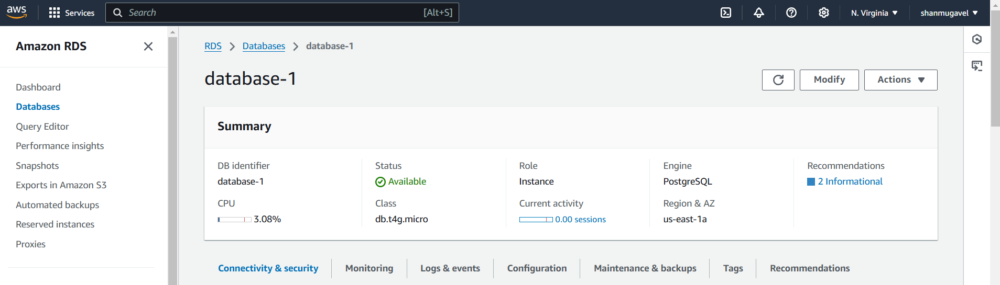

# Airflow ETL Pipeline with AWS RDS Postgres and NASA API Integration

## Table of Content

- [Project Overview](#project-overview)
- [Project Highlights](#project-highlights)
- [ETL Pipeline Chart](#etl-pipeline-chart)
- [Airflow DAG Graph](#airflow-dag-graph)
- [AWS RDS Postgres](#airflow-dag-graph)
- [Astro Cloud Deployment](#astro-cloud-deployment)
- [Technologies Used](#technologies-used)

## Project Overview

This project involves creating an ETL (Extract, Transform, Load) pipeline using Apache Airflow. The pipeline extracts data from an external API (in this case, NASA's Astronomy Picture of the Day (APOD) API), transforms the data, and loads it into a Postgres database. The entire workflow is orchestrated by Airflow, a platform that allows scheduling, monitoring, and managing workflows.

The project leverages Docker to run Airflow and Postgres as services, ensuring an isolated and reproducible environment. We also utilize Airflow hooks and operators to handle the ETL process efficiently.

## Project Highlights

**Extract (E)**:

- The SimpleHttpOperator is used to make HTTP GET requests to NASA’s APOD API.
- The response is in JSON format, containing fields like the title of the picture, the explanation, and the URL to the image.
  **Transform (T)**:
- The extracted JSON data is processed in the transform task using Airflow’s TaskFlow API (with the @task decorator).
- This stage involves extracting relevant fields like title, explanation, url, and date and ensuring they are in the correct format for the database.
  **Load (L)**:
- The transformed data is loaded into a Postgres table using PostgresHook.
- If the target table doesn’t exist in the Postgres database, it is created automatically as part of the DAG using a create table task.

## ETL Pipeline Chart

## Airflow DAG Graph

## Astro Cloud Deployment

Deployed the entire ETL Workflow in Astro Cloud using the following commands:

Step 1:
`astro dev init`

Step 2:
`astro login`

Step 3:
`astro deploy`

## AWS RDS Instance

## Technologies Used

- Python
- Apache Airflow
- Docker
- AWS RDS
- PostgreSQL
- Astro Cloud
